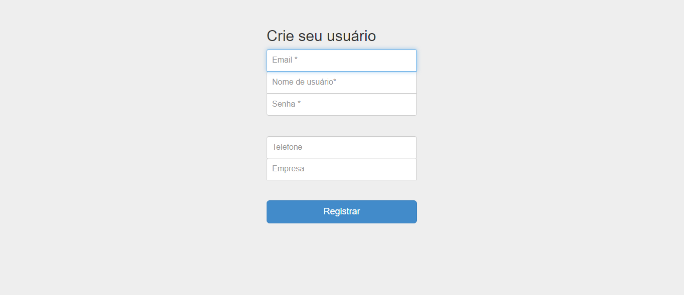
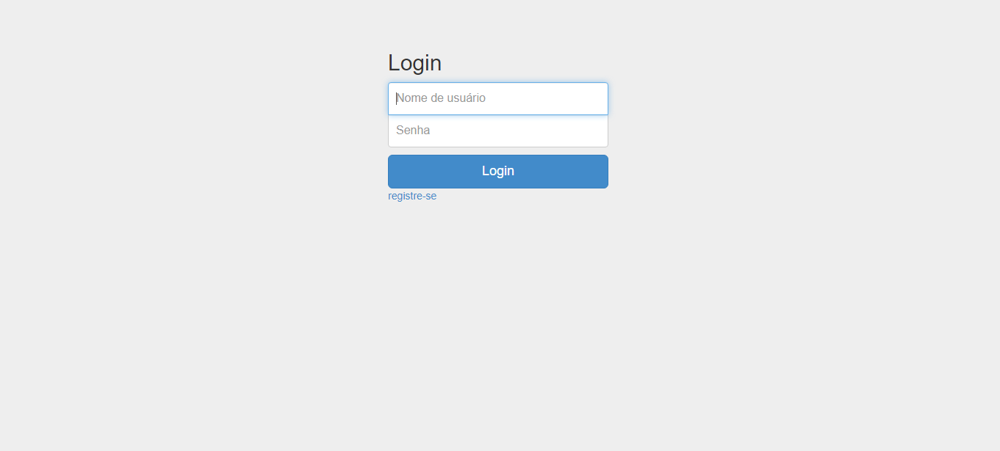
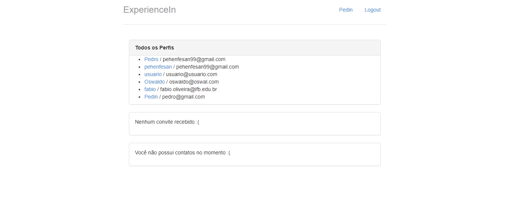
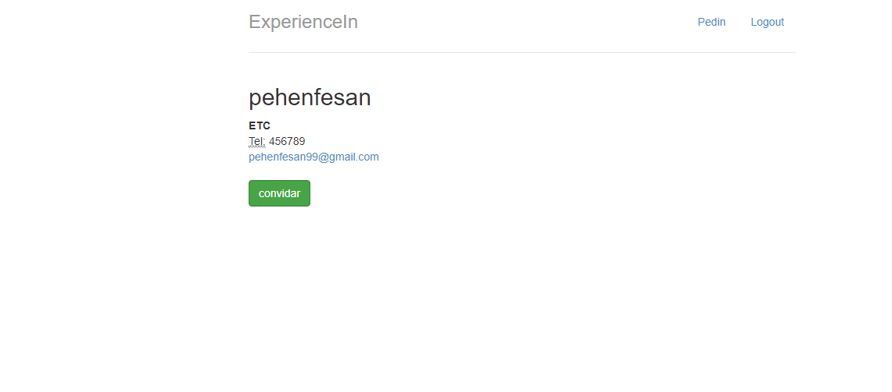

# Projeto_PPI2

## Sobre o autor

Me chamo Pedro Henrique Fernandes de Santana, tenho 22 anos e estou no 5º semestre do curso de Tecnologia em Sistemas para Internet do Instituto Federal de Brasília - IFB.

## Link da Aplicação

http://pehenfesan.pythonanywhere.com/

## O que o projeto faz

O projeto é o desenvolvimento de um sistema de login de usuários para uma rede social, os usuários cadastrados na rede, podem mandar e receber convites de outros usuários.

## Objetivos do projeto:
Esse projeto visa 4 tópicos, a seguir:
 - Desenvolver sistemas web utilizando frameworks modernos.
 - Relacionar técnicas de desenvolvimento web;
 - Implementar APIs para aplicações web;
 - Implantar sistemas web.
 
## Por que o projeto é útil

O projeto vai ajudar o estudante a desenvolver as habilidades necessárias para o mercado de trabalho na área de programação web.

## Telas do Projeto

#### Tela de Registro

A tela apresenta um formulário para o usuário preencher e se registrar.

#### Tela de Login

Tela para o usuário inserir o nome de usuário e a senha para logar no sistema.

#### Tela de Perfis

Essa tela mostra todos os outros perfis presentes na Rede social, se há convites recebidos, e se o usuário ja tem contatos que aceitaram o seu convite de amizade.

#### Tela de Convite

Essa tela mostra as informações sobre o usuário a ser convidado pelo usuário atual.

## Quem mantém e contribui com o projeto

O projeto será mantido e terá a contribuição,a princípio, somente do autor principal, o estudante Pedro Henrique.

## Objetivo do repositório

Repositório para a construção do projeto da matéria de Programação para Internet 2 ao longo do segundo semestre de 2021.
